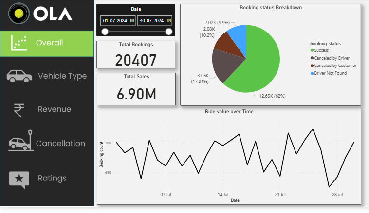
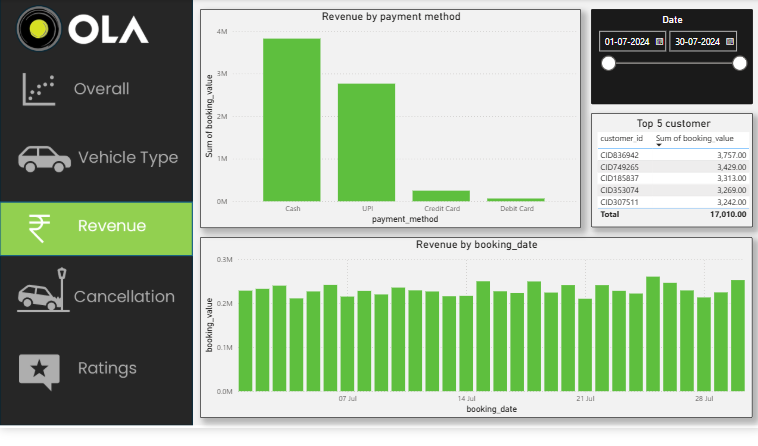
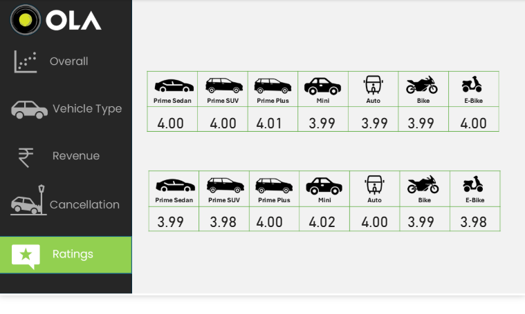

# OLA Ride Booking Analysis

## Project Overview

This project analyzes OLA ride booking data to understand booking
performance, revenue, cancellations, vehicle-type performance, and
customer ratings.

An interactive Power BI dashboard was developed to present the analysis
across multiple business areas and make the results easier to explore.

## Objectives

-   Analyze overall booking performance
-   Understand revenue trends and payment methods
-   Analyze cancellation patterns
-   Compare vehicle types based on booking and distance metrics
-   Review customer and driver ratings
-   Identify useful business insights from ride booking data

## Tools & Technologies

-   **SQL** -- Data analysis and querying
-   **Excel** -- Data preparation and analysis
-   **Power BI** -- Interactive dashboard and visualization

## Dataset

The project uses a cleaned OLA ride booking dataset containing
booking-level information used for analyzing ride status, vehicle type,
revenue, payment method, distance, cancellations, and ratings.

## SQL Analysis

SQL queries were used to perform analysis such as:

-   Retrieve successful bookings
-   Calculate average ride distance by vehicle type
-   Count customer cancellations
-   Identify the top 5 customers by number of rides
-   Analyze driver cancellations related to personal and car issues
-   Find the maximum driver rating for Prime Sedan bookings

## Power BI Dashboard

The dashboard contains five main analysis areas:

### 1. Overall Analysis

Key metrics and visualizations include:

-   Total Bookings: **20,407**
-   Total Sales: **6.90M**
-   Booking Status Breakdown
-   Ride/Booking trends over time

The dashboard shows that successful bookings account for approximately
**62%** of total bookings.

### 2. Revenue Analysis

This page analyzes:

-   Revenue by payment method
-   Revenue by booking date
-   Top 5 customers by booking value

Cash and UPI are the major payment methods by booking value in the
dashboard.

### 3. Cancellation Analysis

This page analyzes:

-   Total cancellations
-   Cancellations by driver
-   Cancellations by customer
-   Driver cancellation trends
-   Cancellation breakdown by status

The dashboard shows **7,755 total cancellations**, with driver
cancellations higher than customer cancellations.

### 4. Ratings Analysis

The dashboard compares ratings across different vehicle types,
including:

-   Prime Sedan
-   Prime SUV
-   Prime Plus
-   Mini
-   Auto
-   Bike
-   E-Bike

Ratings across vehicle types are generally close to **4.0**.

### 5. Vehicle Type Analysis

This page compares vehicle types using:

-   Total Booking Value
-   Success Booking Value
-   Average Distance Travelled
-   Total Distance Travelled

## Key Insights

-   The dashboard recorded **20,407 total bookings** for the selected
    analysis period.
-   Successful bookings represented approximately **62%** of bookings.
-   Total sales/booking value shown in the dashboard was approximately
    **6.90M**.
-   There were **7,755 cancellations**.
-   Driver cancellations were higher than customer cancellations.
-   Cash and UPI were the leading payment methods by booking value.
-   Vehicle types showed relatively consistent ratings around **4.0**.
-   Vehicle types differed in average and total distance travelled,
    providing a basis for comparing vehicle usage patterns.

## Dashboard Preview

### Overall Analysis



### Revenue Analysis



### Cancellation Analysis



### Ratings Analysis


### Vehicle Type Analysis


## Project Structure

``` text
OLA-Ride-Booking-Analysis/
│
├── Dataset/
│   └── bookings_final_cleaned.csv
│
├── SQL/
│   └── ola_analysis.sql
│
├── PowerBI/
│   └── OLA.pbix
│
├── Screenshots/
│   ├── overall.png
│   ├── revenue.png
│   ├── cancellation.png
│   ├── ratings.png
│   └── vehicle_type.png
│
└── README.md
```

## Skills Demonstrated

-   Data Cleaning
-   SQL Analysis
-   KPI Development
-   Business Analysis
-   Data Visualization
-   Power BI Dashboard Development
-   Excel Analysis
-   Insight Generation
